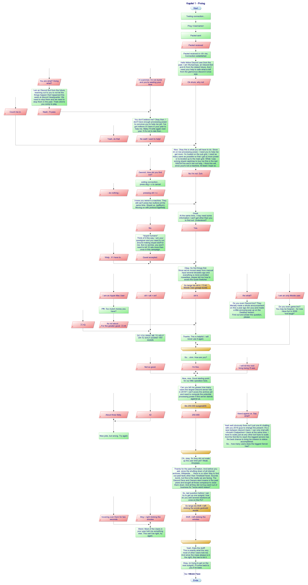
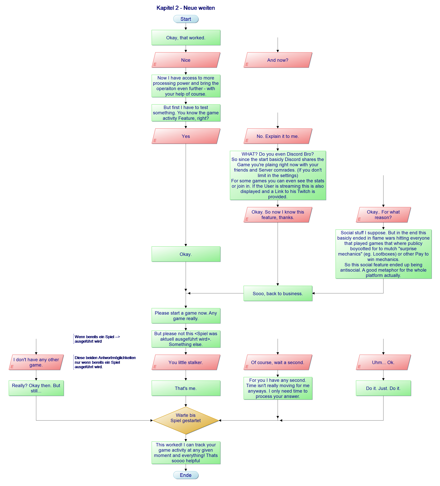

# Story
Here is the playable story. The story file can be edited with this [free program](https://www.heise.de/download/product/papdesigner-51889) alternatively it can be found in the folder assets images of the story line.

## Images

